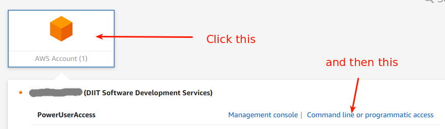

# iiif-sandbox-simple
A simple sandbox for experimenting with different IIIF viewers.

## Acknowledgements
The code and basic implementation for this site was shamelessly borrowed from
[this IIIF Workshop](https://github.com/jronallo/iiif-workshop-new).

## How to update the viewer code
This is easiest to do if you have [Yarn](https://yarnpkg.com/en/) installed.

> WARNING: the version of Yarn provided by most package managment systems will probably be very out of date. You'll want to install the version provided by yarn directly. Here are [instructions for installing Yarn on Ubuntu Bionic (18.4)](https://by-example.org/install-yarn-on-ubuntu-18-04-bionic-beaver-lts/). There are [instructions for installing Yarn on most operating systems](https://yarnpkg.com/en/docs/install) as well.
> You may also encounter error messages about the version of Node you have installed. Currently Mirador and Universal Viewer have a dependency (paper) which requires you to be using Node version 7+, the easiest way to ensure you're using version 7 of Node is to use nvm (node version manager) with this command `nvm use 7`. If you don't already have nvm installed, you can find [installation instructions](https://github.com/nvm-sh/nvm) on its website.


```
yarn add universalviewer
yarn add mirador
cp -r node_modules/mirador/dist mirador
cp -r node_modules/universalviewer/uv uv
```
There may be a better way to refresh the viewer code, but for now, that will
have to do.

## How to manually deploy this code to our AWS S3 bucket
You must first [install](https://docs.aws.amazon.com/cli/latest/userguide/cli-chap-install.html)
and [configure the AWS CLI](https://docs.aws.amazon.com/cli/latest/userguide/cli-chap-configure.html).

Here's a hint, you'll need to login to the [UCLA Library AWS User Portal](https://uclalibrary.awsapps.com/start).
Then find your credentials...


When you have your credentials set up, you can run the following as a sanity check:
```
aws s3 ls
```
If that command returns at least one bucket named `iiif-viewers`, you're ready to deploy!

Assuming you're in the root of this project, run the following to deploy it to
the iiif-viewers bucket on S3:

Start with a dry run to verify everything is OK:

```
aws --dryrun s3 sync . s3://iiif-viewers/ --exclude "node_modules*" --exclude ".git*" --delete
```

As soon as you're sure that command will work correctly, omit the `--dryrun`.

```
aws s3 sync . s3://iiif-viewers/ --exclude "node_modules*" --exclude ".git*" --delete
```
